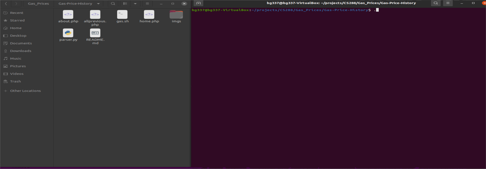
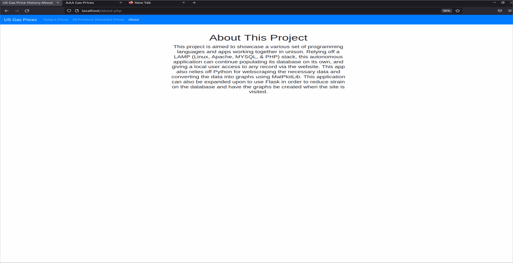
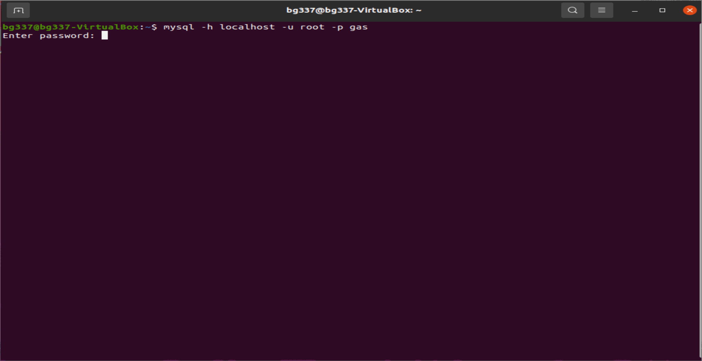

# Gas Price History
LAMP (Linux, Apache, MySQL, PHP) stack based app that webscrapes gas prices, turns the data into a graph, and records the graphs in a database. Using a local host, webpages display today's or older records from the database to the site.

## Running The App

To get the appication running on your local machine, you will need Apache and have the .php files stored in /var/www/html on Linux. 

You will also need the SQL database. I used a database called "gas" and the table called "imgs" with three columns for the gas type, date, and the img itself.

Another applicaion, tagsoup, is required to format the html into a xhtml however the bash file already will check for it and install it if necessary.

These are the MySQL commands I used: 
* CREATE DATABASE gas; 
* CREATE TABLE imgs(gastype VARCHAR(3) NOT NULL, date VARCHAR(10) NOT NULL, img MEDIUMBLOB NOT NULL);

To populate your database, simply run the bash script on Linux and ensure that your localhost name, username, password, and database name are equivalent to what your code has.

## LAMP Explanation

### Linux
Linux is an operating system which gives software developers more power than Windows.

Linux is used here for:
* Bash, a powerful programming language.

Bash allows commands like downloading and deleting files which is necessary for this project.

Bash is used here for:
* Downloading websites to acquire daily gas prices.
* Downloading a necessary dependency, a library called tagsoup, which converts HTML websites to XML if it is not already installed.
* Executing the Python program which parses the downloaded and organized site file.
* Deleting the recently created graph images once they are uploaded to the database.
* Deleting the recently downloaded site files after their data has been utilized.
* Running the program once every day.

Walkthrough of Running Bash Script:

### Apache
Apache is a web server.

Apache is used here for:
* Have the websites run on a local machine.

Walkthrough of My Local Site Hosted with Apache:

### MySQL
MySQL is a database manangement software for managing SQL databases. 

MySQL is used here for:
* Creating SQL database.
* Adding data to the database via Python code.
* Reading data from the database via PHP.

SQL is used here for:
* Holding the data.

Walkthrough of MySQL & SQL Database:

### PHP
PHP is a scripting language which is mainly used for web development. 

PHP is used here for: 
* Allowing website to connect to the database.
* Grabbing specifically today's data.
* Grabbing all records ever recorded.

Walkthrough Not Applicable, Reference The Code
